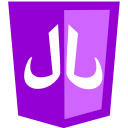

# JsLingua


[](https://nodei.co/npm/jslingua/)

[](https://kariminf.github.com/jslingua.web)
[](http://www.apache.org/licenses/LICENSE-2.0)
[](https://www.npmjs.com/package/jslingua)
[](https://gemnasium.com/github.com/kariminf/jslingua)
[](https://travis-ci.org/kariminf/jslingua)
[](https://codecov.io/gh/kariminf/jslingua)
[](https://www.npmjs.com/package/jslingua)
[](http://inch-ci.org/github/kariminf/jslingua)
[](https://www.codefactor.io/repository/github/kariminf/jslingua/overview/master)
[](https://codebeat.co/projects/github-com-kariminf-jslingua-master)
[](https://codeclimate.com/github/kariminf/jslingua/)
[](https://twitter.com/jslingua)


This project aims to afford some of the tasks related to languages, such as: detecting language, some transformations (majuscule to minuscule), verb conjugation, etc.
There are a lot of projects like this such as: [NLTK](https://github.com/nltk/nltk) (python), [OpenNLP](https://github.com/apache/opennlp) (Java), etc.
But, mostly, they are server side and needs some configurations before being put in action.

A lot of tasks doesn't need many resources such as stemming, tokenization, transliteration, etc.
When we use these toolkits in a web application, the server will do all of these tasks.
Why not exploit the users machines to do such tasks, and gain some benefits:
* The server will be relieved to do some other serious tasks.
* The number of communications will drop, resulting in a faster respond time which leads to a better user experience.
* The amount of exchanged data may drop; this case is applicable when we want to send a big text, then we tokenize it, stem it and remove stop words. This will decrease the size of data to be sent.
* Easy to configure and to integrate into your web pages.

Also, it can be used in server side using [node.js](https://github.com/nodejs/node).

The project's ambitions are:
* To deliver the maximum language-related tasks with a minimum of resources pushed down to the client.
* To benefit from oriented object programming (OOP) concepts so the code will be minimal and readable.
* To give the web-master the ability to choose witch tasks they want to use by using many modules instead of using one giant program.
* To afford good resources for those who want to learn javascript programming.
* **TO HAVE FUN**: programming is fun, spend time for useful things, happiness is when your work is helpful to others, more obstacles give more experience.


## Functionalities

Javascript library to process languages:
* Information about the language
* Basic language functions:
  * Detection of language's characters
  * Transforming numbers to strings (pronunciation)
* Transliteration: different transliteration methods including Morse code.
* Morphology: different morphological functions
  * Verb Conjugation
  * Stemming: deleting affixes (suffixes, prefixes and infixes)
  * Noun declension: from feminine to masculine and the inverse, from singular to plural, etc.

To get the list of available functionalities, check [FCT.md](./FCT.md)

## How to use?

### Use in Browser

Just import the class that you want to use and its implementations.
You, always, have to import "jaslingua" first, then the module class, then its implementations.
Here the importation of all classes, where:
* < module > : info, lang, trans, morpho
* < lang > : ara, jpn, eng

```javascript
<script type="text/javascript" src="jslingua.js" ></script>
<script type="text/javascript" src="<module>.js" ></script>
<script type="text/javascript" src="<lang>/<lang>.<module>.js" ></script>
...
```
You can use a CDN (content-delivery network):
```javascript
<script type="text/javascript" src="https://unpkg.com/jslingua@version/file" ></script>
```
if you want to use the last version, just replace "version" with "latest".
For example:
```javascript
<script type="text/javascript" src="https://unpkg.com/jslingua@latest/jslingua.min.js" ></script>
<script type="text/javascript" src="https://unpkg.com/jslingua@latest/lang.min.js" ></script>
<script type="text/javascript" src="https://unpkg.com/jslingua@latest/ara.lang.min.js" ></script>
...
```

### Use in Node

First of all, you have to install the package in your current project
```
npm install jslingua
```
Then in your test file, call the main module "jslingua".
```javascript
var JsLingua = require("jslingua");
```

### Get the services (Browser & Node)

You can call them one by one, if you know the services and their implemented languages.
```javascript
//Get Arabic Info class
var ArInfo = JsLingua.getService("Info", "ara");

//Get Japanese Trans class
var JaTrans = JsLingua.getService("Trans", "jpn");

//Get English Lang class
var EnLang = JsLingua.getService("Lang", "eng");

//Get Arabic Morpho class
var ArMorpho = JsLingua.getService("Morpho", "ara");

//Get French Morpho class
var FrMorpho = JsLingua.getService("Morpho", "fra");
```

Or, you can just loop over the services and test available languages.
For example, the "Info" service:
```javascript
//Get the list of languages codes which support the Info service
var langIDs = JsLingua.serviceLanguages("Info");
var result = "";
var i;
for (i = 0; i < langIDs; i++){
  var infoClass = JsLingua.getService("Info", langIDs[i]);
  var info = new infoClass();
  result += i + "- " + info.getName() + "\n";
}
```

## Community

All the C's are here:

* [CONTRIBUTING](./CONTRIBUTING.md) : How to contribute to this project
* [CODE OF CONDUCT](./CODE_OF_CONDUCT.md) : Some recommendations must be followed for a healthy development environment.
* [CHANGELOG](./CHANGELOG.md) : Changes in every version
* [CREDITS](./CREDITS.md) : List of contributors

If you are looking to have fun, you are welcome to contribute.
If you think this project must have a business plan, please feel free to refer to [this project (click)](https://github.com/kariminf/tnbp)


## More

You can test the browser version on [https://kariminf.github.io/jslingua.web](https://kariminf.github.io/jslingua.web)

You can test nodejs version online on [https://runkit.com/npm/jslingua](https://runkit.com/npm/jslingua)

jsdoc generated API is located in [https://kariminf.github.io/jslingua.web/docs/](https://kariminf.github.io/jslingua.web/docs/)

Examples on how to use JsLingua are located in [https://github.com/kariminf/jslingua_docs](https://github.com/kariminf/jslingua_docs)

A tutorial on how to use JsLingua is located in [https://github.com/kariminf/jslingua_docs/blob/master/doc/index.md](https://github.com/kariminf/jslingua_docs/blob/master/doc/index.md)

A Youtube tutorial for JsLingua and nodejs is located in this list: [https://www.youtube.com/watch?v=piAysG5W55A&list=PLMNbVokbNS0cIjZxF8AnmgDfmu3XXddeq](https://www.youtube.com/watch?v=piAysG5W55A&list=PLMNbVokbNS0cIjZxF8AnmgDfmu3XXddeq)


## License

Copyright (C) 2016-2018 Abdelkrime Aries

Licensed under the Apache License, Version 2.0 (the "License");
you may not use this file except in compliance with the License.
You may obtain a copy of the License at

http://www.apache.org/licenses/LICENSE-2.0

Unless required by applicable law or agreed to in writing, software
distributed under the License is distributed on an "AS IS" BASIS,
WITHOUT WARRANTIES OR CONDITIONS OF ANY KIND, either express or implied.
See the License for the specific language governing permissions and
limitations under the License.
